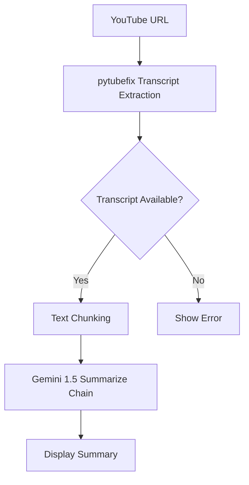

# Backend Architecture & Flowcharts

This document provides a technical overview of the backend logic for the AskMyPdf project.

## PDF Interaction (RAG)

The PDF Exploration module implements a Retrieval-Augmented Generation (RAG) pipeline to provide accurate answers based on document content.

```mermaid
graph TD
    A[PDF Upload] --> B[MD5 Hashing]
    B --> C{Existing Chroma DB?}
    C -- No --> D[PyPDFLoader]
    D --> E[RecursiveCharacterTextSplitter]
    E --> F[HuggingFace Embeddings]
    F --> G[Chroma Vector Store]
    C -- Yes --> G
    G --> H[User Question]
    H --> I[Similarity Search (Top 5)]
    I --> J[Context Building]
    J --> K[LLM Generation (Llama 3.1)]
    K --> L[Save Chat History]
```

## YouTube Summarization

The YouTube Summarizer leverages video transcripts and Gemini 1.5 to distill video content.



## Tech Stack

- **Framework**: Streamlit
- **Orchestration**: LangChain
- **Vector Database**: Chroma
- **LLMs**: Groq (Llama 3.1), Ollama (Local), Google Gemini 1.5
- **Embeddings**: HuggingFace (all-MiniLM-L6-v2)
