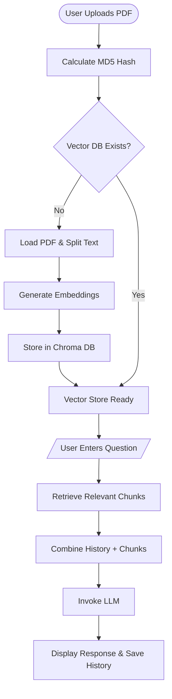
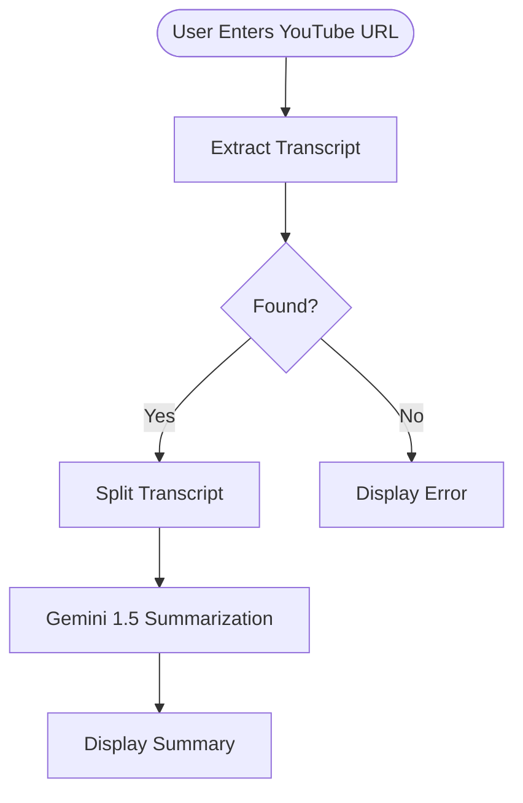

# AskMyPdf 🤖

AskMyPdf is a powerful Streamlit application that allows users to interact with PDF documents using AI-driven chat (RAG) and generate concise summaries for YouTube videos.

## 🚀 Features

-   **PDF Exploration**: Upload PDFs, generate summaries, questions, and key takeaways.
-   **RAG-based Chat**: Intelligent conversation using context from your uploaded documents and chat history.
-   **YouTube Summarizer**: Extract transcripts and summarize YouTube videos instantly.
-   **Persistent History**: Local storage of chat sessions for future reference.

---

## 🛠️ Setup Instructions

### 1. Prerequisites
- Python 3.10+
- [Ollama](https://ollama.com/) (if using local models like Llama 3.1)

### 2. Installation
Clone the repository and install dependencies:

```powershell
python -m venv venv
.\venv\Scripts\activate
pip install -r requirements.txt
```

### 3. Configuration
Create a `.streamlit/secrets.toml` file in the project root and add your API keys:

```toml
GROQ_API_KEY = "your_groq_api_key"
GEMINI_API_KEY = "your_gemini_api_key"
```

---

## 🔄 Backend Working Flow

### PDF Chat (Retrieval-Augmented Generation)
1.  **Ingestion**: PDF is uploaded, hashed for caching, and processed into text.
2.  **Vectorization**: Text is split into chunks and converted into embeddings using HuggingFace models.
3.  **Storage**: Embeddings are stored in a local Chroma vector database.
4.  **Retrieval**: When a user asks a question, the system retrieves the top 5 most relevant chunks and recent chat history.
5.  **Generation**: The context is passed to the LLM (Groq/Ollama) to generate a precise answer.

### YouTube Summarizer
1.  **Extraction**: Extract transcript/captions from the provided URL.
2.  **Processing**: Split the transcript into manageable chunks.
3.  **Summarization**: Use Google Gemini 1.5 to generate a high-level summary of the content.

---

## 📊 Backend Flowchart

### RAG & PDF Processing Flow



### YouTube Summary Flow



---

## 📂 Project Structure

-   `main.py`: Entry point for Streamlit navigation.
-   `pages/`: Individual application pages (PDF and YouTube).
-   `vector_db/`: Local storage for document embeddings.
-   `chats/`: JSON storage for persistent chat history.
-   `.agent/workflows/`: Automated workflows for setup and usage.
